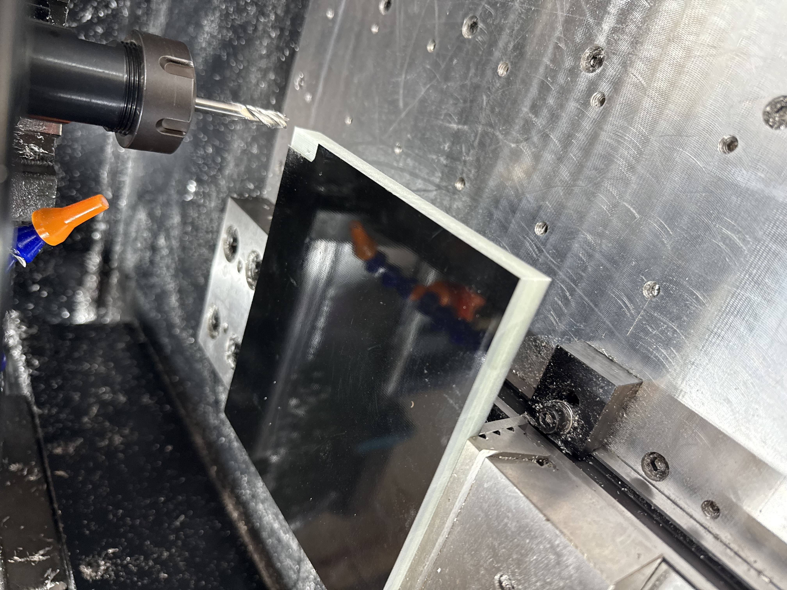
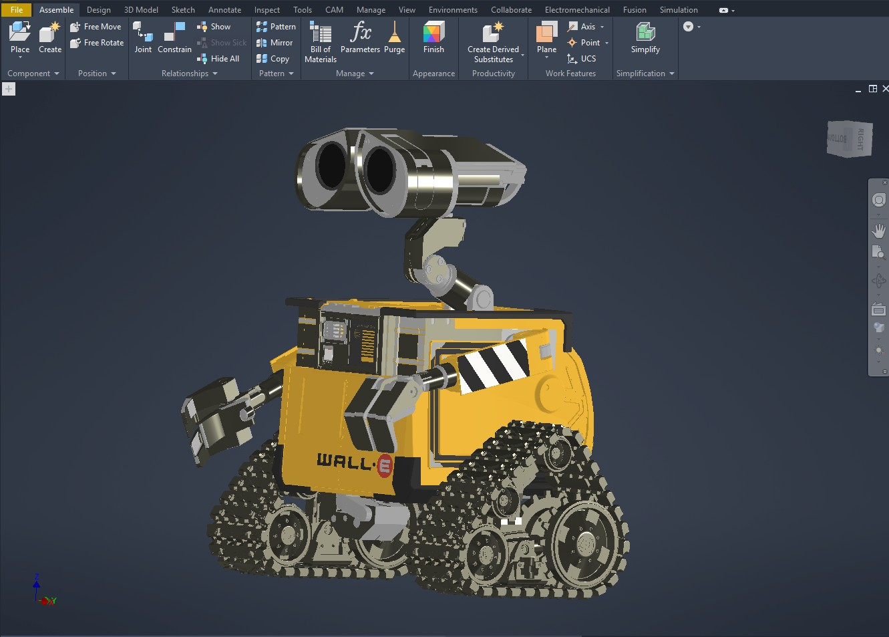

# Rey Soto

**Controls · Systems · Data · Show Technology**

I work across industrial controls, automation, enterprise data and machine learning, embedded systems, and themed entertainment. My experience spans the U.S. Air Force, Boeing, Universal Orlando, GE power generation, Insteel Industries, and Walt Disney World.

The projects here connect physical equipment with the controls, information, and fabrication needed to make it work: production visibility across ten plants, attraction commissioning, animatronic diagnostics, and independent builds from electronics to finished show pieces.

[Engineering work](#engineering-work) · [Personal builds](#personal-builds) · [Other projects](#other-projects)

## Engineering work

### Insteel Industries

**Industrial controls and production intelligence across ten plants**

Built and deployed a SCADA and production-monitoring platform across ten manufacturing facilities, giving operations and executive teams live production visibility with consistent data models and alarm structures.

Developed a maintenance pipeline combining equipment-condition, vibration, and oil-analysis data with machine learning and IBM Maximo work orders. Controls modernization included a phased migration to Siemens S7 hardware across the plant network.

### Universal Orlando Resort

**Ride systems, show coordination, and commissioning**

Worked across hydraulic motion platforms, show timing, scene props, and ride controls on attractions including Despicable Me, The Simpsons, and Transformers. Joined the VelociCoaster Commissioning & Test team, partnering with Design Engineering on ride-control validation, electrical testing, and calibration against OEM and engineering requirements.

### GE Vernova

**Field engineering for power generation**

Provided on-site technical direction for installation, commissioning, and maintenance of large steam-powered generation systems at international sites, including leadership of skilled union labor teams.

### Walt Disney World

**Animatronic diagnostics and show-system reliability**

Work at Magic Kingdom West includes electrical, mechanical, and controls diagnostics on animatronic figures, show lighting, and ride systems. Traced a lighting reliability issue to a power-supply specification mismatch, with findings leading to a manufacturer replacement program at no cost to operations. Also train technicians in diagnostic workflows and animatronic-system fundamentals.

## Personal builds

### Jolly Roger

**Completed · Animatronics, fabrication, and show programming**

A wall-mounted Jolly Roger skull and ship's wheel, inspired by Pirates of the Caribbean. The articulated jaw uses a servo and linkage mechanism. Structural and wheel components were CNC milled from aluminum on my home-built machine; the skull, shell, and detail parts were 3D printed. The finished installation brings mechanical design, fabrication, and show programming together.

[Demonstration video 1 (MP4)](assets/jolly-roger/jolly_roger_video_01.mp4) · [Demonstration video 2 (MP4)](assets/jolly-roger/jolly_roger_video_02.mp4)

### Custom CNC mill

**Designed, built, and commissioned**

A custom milling machine capable of machining aluminum. The work covered mechanical design, motion-control integration, and toolpath programming. It also provides the fabrication capability used in my animatronic projects.

### WALL-E

**In progress · CAD design and animation programming**

A full-size character build exploring mechanical structure, track drive, head and eye mechanisms, arm articulation, custom electronics, and multi-axis motion. The current phase combines CAD development with an animation framework for choreographed character movement.

### Other projects

- **S7-1200 home automation:** Active HVAC and septic lift-station controls using Siemens S7-1200, VFDs, ET200 distributed I/O, PWM, pump sequencing, and fault alarms.
- **PCB design:** Schematic capture, layout, and custom-board development. [View the RP2350 logic-analyzer schematic](assets/pcb/logic-analyzer/schematic.jpg).
- **Bayou Bites:** A browser rhythm game built with HTML5 Canvas, Web Audio, sprite animation, and adaptive beatmaps. [Project notes](assets/bayou-bites/README.md) · [Gameplay preview](assets/bayou-bites/preview.png).
- **PIXIE:** An independent encoder-bridge proof of concept using RP2350 nodes and the PSYNC protocol. Node-to-node encoder transmission is demonstrated; live servo-drive integration is a next step. [Technical brief](assets/pixie/PIXIE_PSYNC_Technical_Brief.pptx).

[Explore the animatronic maintenance project](animatronic-maintenance/README.md)

<!--
Content source: the existing public index.html, specifically the hero, projects,
timeline, personal-build descriptions, and PCB gallery metadata. Project status
labels follow that published source. The maintenance-project link is supplied
as a separate project destination; no additional project claims are made here.
-->
